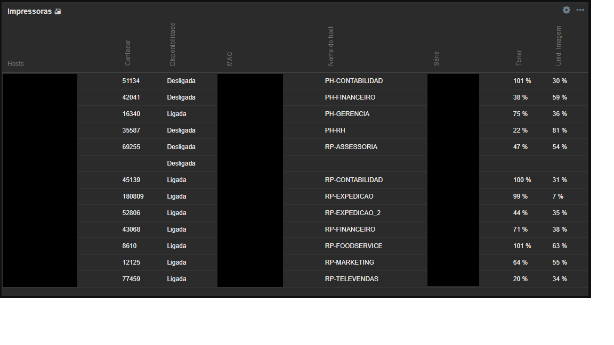

# 🖨️ Template Zabbix – HP Laser MFP 432

Template desenvolvido para o **Zabbix 6.0+ e Zabbix 7.0**, com foco no monitoramento de impressoras **HP Laser MFP 432** via **SNMP v1/v2c**.  
Criado com o objetivo de ajudar a comunidade Zabbix a implementar uma solução **simples, funcional e confiável** para monitoramento de impressoras HP.

---

## ⚙️ Recursos Monitorados

- 🧴 **Nível de toner (%)**
- 📄 **Contador total de páginas**
- 💡 **Status da unidade de imagem**
- ⏱️ **Tempo de ligado (Uptime)**
- 🖥️ **Nome do equipamento e status atual**
- 🔌 **Disponibilidade (Ligada / Desligada)**
- 🔢 **Endereço MAC**
- 🏷️ **Número de série da impressora**

---

## 🧠 Requisitos e Compatibilidade

- Zabbix **6.0 ou superior**  
- Totalmente **testado e funcional** nas versões **Zabbix 6.0 LTS** e **Zabbix 7.0**
- Impressora **HP Laser MFP 432** (compatível também com os modelos **433** e **437**)
- SNMP habilitado na impressora

---

## 🚀 Importação do Template

1. Acesse o painel do Zabbix → **Configuração → Templates**
2. Clique em **Importar**
3. Faça o upload do arquivo `Template_HP_Laser_MFP_432.xml`
4. Confirme e associe o template ao host desejado

---

## 📊 Exemplo de Dashboard

O template exibe informações detalhadas como **contador de páginas, status, nível de toner, unidade de imagem e disponibilidade** em um painel simples e intuitivo:

> Exemplo real obtido no Zabbix 7.0

---

## 📊 Exemplo de Itens e Gráficos

| Tipo de Métrica | Descrição | Unidade |
|------------------|------------|----------|
| Toner Level | Percentual de toner restante | % |
| Total Pages | Contador total de páginas impressas | páginas |
| Drum Unit | Status da unidade de imagem | % |
| Uptime | Tempo desde o último restart | hh:mm:ss |
| Availability | Status da impressora (Ligada/Desligada) | texto |

---

## 🧩 Estrutura do Repositório

zabbix-template-hp-laser-mfp-432/
│
├── Template_HP_Laser_MFP_432.xml
├── README.md
├── LICENSE
└── screenshots/
├── overview.png
└── graph-example.png

---

## 📜 Licença

Este projeto está licenciado sob a **MIT License** – você pode usar, modificar e distribuir livremente, desde que mantenha os créditos ao autor.

---

## 👨‍💻 Autor

Desenvolvido por **João Moraes**  
📍 Grupo Utam – Departamento de TI  
💼 [GitHub: jmoraes18](https://github.com/jmoraes18)

---

## ❤️ Agradecimento

Este projeto é aberto e gratuito, feito para ajudar técnicos, administradores e entusiastas do Zabbix que precisam de uma forma prática de monitorar impressoras HP.  
Contribuições são bem-vindas! Sinta-se à vontade para abrir **issues** ou enviar **pull requests**.
